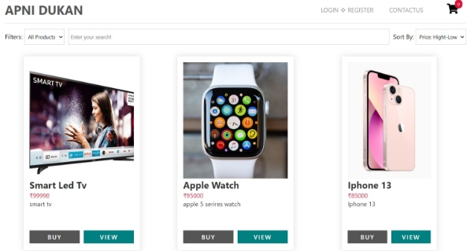
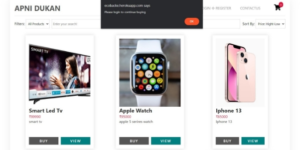
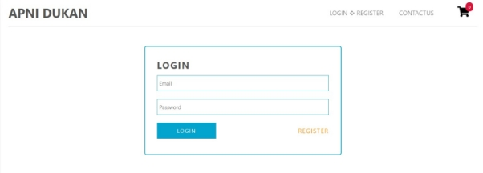
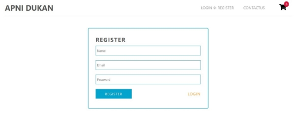
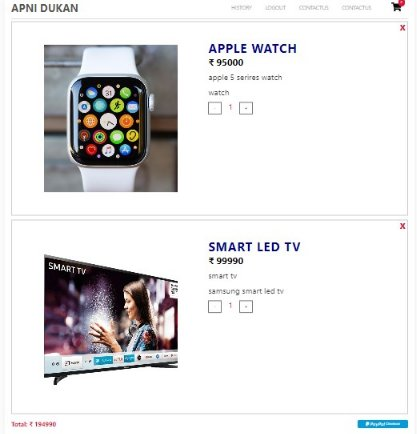
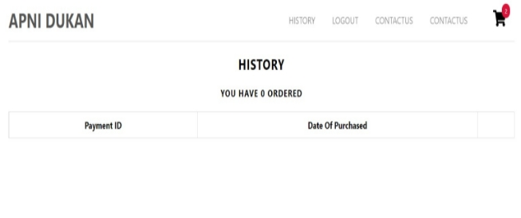

# MERN Stack - Ecommerce

> Ecommerce website built with the MERN stack with React Context API for state management, pure CSS for style

## Demo: https://ecobacke.herokuapp.com/

## Author: Mohit Kushwaha

## Install dependencies for server

### `npm install`

## Install dependencies for client

### cd client ---> `npm install`

## Connect to your mongodb and add info in .env

## Add your paypal client id in client/src/components/mainpages/cart/PaypalButton.js

## Run the client & server with concurrently

### `npm run dev`

## Run the Express server only

### `npm run server`

## Run the React client only

### `npm run client`

### Server runs on http://localhost:5000 and client on http://localhost:3000

` `**Welcome To Apni Dukan**

**This is Landing Page**

It has Some Validation like no can buy or add to cart without login

It will throw the above error If someone tries to do so.

After that we have view button which lead us to description and related Products

**This is Our Login Page**

**This is our Register Page**

**After login or Registration our Page will look like this**

**And we can logout from the Header Logout Button**

**After adding Products to our Cart, we have our Cart like this**

**This is Our order Page Where we Can have a track of Our Purchases**

**This is our Contact Page**

